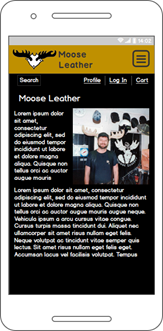
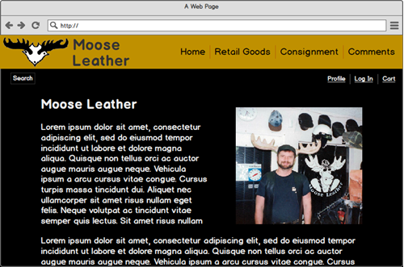

## Moose Leather Online Store

Back in the 90's, I owned a store called Moose Leather in San Diego, California that specialized in the creation custom-made 
leather goods. We also carried off-the-rack merchandise as well as consignment of people's leather items on which we 
received a commission when the item sold.

For my final project I decided to create an online version of that store, including the ability for users to post their own 
items for sale on consignment.

Since this is a concept website, most of the information is latin placeholder text and the images are photos from my 
scrapbooks. Additionally, a real online store would offer many more items for sale.

The website can be viewed at https://moose-leather.herokuapp.com/ 
The code base is available at https://github.com/swendt57/moose_leather_project
To access the admin area, use these credentials:
U: mooseman
P: unGulate
To access the app as a regular user who has stored shipping info:
U: mooseboy
P: lil_unGulate

### UX
User Stories
* Users want to be able to purchase specialty leather goods online
* Users want to be able to sell their own used specialty leather goods
* Users want to be able to search for items
* Users want to be able to see photos of any potential item for purchase

Future User Stories
* Users want to be able to search for items by category, price, etc.
* Users want to learn about the how each type of leather item is used or worn
* Admins need to approve consignment items
* Admins to be able to generate reports

Basic mock-ups of the site can be downloaded from my GitHub site at https://github.com/swendt57/moose_leather_project/tree/master/support/mock-ups

### Features

* A Home page that gives background on Moose Leather and the concept behind the website.
* A built-in Django Admin function for entering items for sale, editing uploaded consigned items, and manipulating user info.
* The project is broken into the following sections:
  * An Accounts app that handles user registration, logging in and out, and a reset-password function. It also handles storing User Shipping Info.
  * A General app that serves up the Home page and the Disqus-based Comments / Discussion page.
  * A Products app that is responsible for showing the items for sale, both retail and consigned. The main models are Item and Category
  * An Order app which provides Order and Line Item models which are used for storing sales info
  * A Cart app, which maintains the user's selected items for purchase that can be displayed from any page of the application.
  * A Checkout app that handles processing payments using Stripe.com, and upon success, inserts the sales info into the appropriate tables. 
  * A Search app that allows a user to search the New Goods and Consigned Goods item titles.
  * A Disqus based Comments and Discussion page where users can add and comment on each other's posts.
* Other features include:
  * A form that allows users to upload their own items for sale, including a photograph of the item.
  * A JavaScript based photo handler that adjusts the image's dimensions as the Bootstrap panels expand and contract depending on screen size for maximum visual impact.
  * A JavaScript based card sizer that adjusts the size and position of the cart's total / price panel to be aesthetically pleasing to the eye.
  * A collapsible search input field that does not detract from the look and feel of the web app.
  * The ability for a user to store the shipping information that allows the app to pre-populate their order checkout form.
  * Pagination that allows a reasonable number of items per page and adjusts that number based on the user's screen-size.
  * An item details page that provides background information on how the item is used and the history behind it and returns the user to the same point in the pagination sequence.
  * A Disqus-based discussion section on each details page, that maintains a separate thread for each item.
  * Using Django template "includes" to reuse repititive sections of code.
  
#### ER Diagram
  
 
The full size diagram is available in GitHub at https://github.com/swendt57/moose_leather_project/blob/master/support/Moose_Leather_ER.pdf

#### Future Features

* Add a consignment approval process that will allow an admin to approve or disapprove a consignment posting.
* Add an Inventory app that maintains current stock levels and that the Products app can use to verify availability.
* Add in support for sales tax.
* Extend the Search app to allow searching by category, size, etc.
* Write an Image Adjuster app that will automatically trim down larger photos on their way into the system.
* Allow for multiple images for an item, instead of just one. 
* Provide single-sign-on for both the website and Disqus. Currently posting to Disqus requires a separate log in unless I sign up for a costly monthly subscription.
* Add support for SCSS to remove duplication in the stylesheet.

### Technologies Used 

* Python
  * https://www.python.org/
  * The main language used for the project
* Django
  * https://www.djangoproject.com/
  * The Python framework used for the project
* JavaScript
  * https://www.javascript.com/
  * The main scripting language that I used for navigation, photo adjustment, etc
* jQuery
  * https://jquery.com/
  * JavaScript library that simplifies DOM manipulation
* HTML5
  * https://www.w3.org/
  * The fifth major revision of HTML that is used in the projects templates
* CSS3
  * https://www.w3.org/
  * The third major revision of CSS that is used in the projects templates
* PyCharm
  * https://www.jetbrains.com/pycharm/
  * Python integrated development environment
  * My preferred Python IDE
* Bootstrap 4
  * https://getbootstrap.com/docs/4.0/getting-started/introduction/
  * Responsive, mobile-first, framework
* Google Fonts
  * https://fonts.google.com/
  * Free, open-source, on-demand, fonts
* Font Awesome
  * https://fontawesome.com
  * Icons and such
* GitHub
  * https://github.com/swendt57
  * Code repository
* Heroku
  * https://www.heroku.com/home
  * Cloud host of the website
* SQLite Database
  * https://www.sqlite.org/
  * Embedded database used by Django for development
* PostgresSQL Database
  * https://www.postgresql.org/
  * Production database hosted on Heroku
* Amazon Web Services S3 Bucket
  * https://aws.amazon.com/
  * For storing static and media files
* Stripe
  * https://stripe.com
  * Payment processor for the site (credit cards)
* Travis CI
  * https://travis-ci.org/
  * A continuous integration platform for building and testing code changes
* Stack Overflow
  * https://stackoverflow.com/
  * Community of developers that has potential solutions to almost any problem

### Testing

**Automated testing**

The automated testing uses Django's testing framework that can be run manually by typing **manage.py test** in 
the terminal window. Additionally, the application is configured with Travis CI that runs the tests automatically upon each
push to the GitHub rep. 

**Manual Testing**

**Note:** you may have to refresh the page or click a nav button in order to trigger the correct number of panels per page.

Admin Functions
1. Verify that only an admin can log into the admin application.
2. Verify that each type of object can be added and/or edited.

Site Wide
1. Verify you can log in and log out.
2. Verify that you can register a new user.
3. Verify that the Do you have something to sell? link loads the Consignment Upload page.

New Goods and Consigned Goods
1. Verify that each page has a series of item panels.
2. Verify that the title in each panel is a hyperlink to its details page.
3. Verify that there is pagination and that it functions logically.
4. Verify that returning from a details page returns the user to the same place in the pagination sequence.54. Verify that the Add to Cart button adds the item to the cart and that the cart icon in the upper-right updates the number.
5. Verify that you can upload a consigned item for sale including an image (note restrictions on image size and dimensions).

Cart
1. Verify that the correct items appear on the cart page (cart icon is on the upper-right of all pages).
2. For new goods, verify that the quantity of each item can be adjusted.
3. For new goods, verify that the item can be removed by selecting a quantity of zero before clicking the Adjust Cart button.
4. For consigned goods, verify that the Remove from Cart button removes the item.
5. Verify that the total shown in the Total is correct.

Checkout
1. Verify that the contents of the table match what is expected.
2. If signed in as a user with stored shipping info.
3. Verify you van check out, use card 4242424242424242 exp 10/2020 cvv 123

**Manual testing** was performed on: 
* Chrome version 80.0.3987.132 browser including:
  * Galaxy S5 simulator
  * iPhone 6/7/8 simulator
  * iPad simulator
  * iPad Pro simulator
* Firefox 74.0 browser including:
  * Galaxy S9/S9+ simulator
  * iPhone X/XS simulator
  * Kindle Fire HDX simulator
* Galaxy S10e phone with:
  * Chrome mobile version 80.0.3987.132
  * Firefox for Android version 68.6.0
  
##### Interesting Bug

Spent quite a bit of time trying to find a very hard-to track-problem.  I had cut and pasted some 
configuration text from my notes trying to avoid typos. What I did not realize was that Word does not, by default,
use standard quotes but instead replaces them with their "smart quotes" which are not standard characters in
 character encoding standard!

##### Known Issues

* On some Android for Chrome screens, the tan magnifying glass icon changes color and shows with a green diamond shaped background.

### Travis Continuous Integration

### Deployment

The website is deployed on Heroku at https://moose-leather.herokuapp.com/  

These instructions are for the initial deployment of the Django project on Heroku. They are high-level only

1. In the terminal, create and prepare the project space on Heroku:
   * Log into Heroku
   * Create the app (project) > heroku apps:create moose-leather
   * Add a Postgres database > heroku addons:create heroku-postgres:hooby-dev
   * Install packages needed for Django > pip install 
     * gunicorn
     * psycopg2
2. In the project, do the following:
   * Verify that both Profile and requirements.txt files are both up-to-date.
   * In settings, verify that DATABASE_URL points to the Postgres DB on Heroku.
   * In settings, set DEBUG = False
3. Back in the terminal, 
   * run > manage.py makemigrations and > manage.py migrate to populate the tables on Heroku
   * run > django-admin > createsuperuser
4. Verify that the AWS Bucket has been set up and all applicable configurations are in place.
5. On the Heroku Dashboard for the app, set the configuration Variables:
    1. Click Settings to open the settings page.
    2. Click the Reveal Config Vars button to show the configs.
    3. Add the following keys and applicable values. The values are kept separate from the project so as not appear in GitHub:
        * AWS_ACCESS_KEY_ID
        * AWS_SECRET_ACCESS_KEY
        * DATABASE_URL
        * EMAIL_ADDRESS
        * EMAIL_HOST_PASSWORD
        * SECRET_KEY
        * STRIPE_PUBLISHABLE
        * STRIPE_SECRET
    4. On the Deploy tab, link Heroku to the GitHub project
6. Verify that the local Git repo is up-to-date and from the terminal type > git push origin master
7. Initiate the deploy on heroku.
6. If needed, restart the dynos. 
    1. On the Heroku Dashboard, click the More button in the upper-right corner.
    2. From the drop-down, select Restart all dynos
7. If you have lead a good, clean life, the app is deployed... If not, troubleshoot! :-)  

#### Local Development using PyCharm

1. Clone the app from GitHub (URL above)
2. Open the project using PyCharm 
3. In settings: 
   * Set DEBUG = True
   * Comment out the two STATIC entries marked if you want to use local static
   * Comment out the other databases and just use local
4. Verify that all the needed modules are installed (see requirements.txt)
5. Click the Run button and cross your fingers!

NOTE: Before you can install some of the requirements on a Windows machine, you will have to install the following in Windows:
* zlib.exe (used by pillow)
* MS Visual Studio Build Tools (used by pyscopg2)
*

### Acknowledgements
* **Many thanks** to Vitor Freitas for the clear Python and Django tutorials - https://simpleisbetterthancomplex.com/
* Wood texture background courtesy of https://www.deviantart.com/ftourini
* Text shadowing - https://html-css-js.com/css/generator/text-shadow/
* Fixtures and testing - https://django-testing-docs.readthedocs.io/en/latest/fixtures.html
* Calling super() on setUpClass in tests - https://stackoverflow.com/questions/29653129/
* Resetting migrations - https://simpleisbetterthancomplex.com/tutorial/2016/07/26/how-to-reset-migrations.html
* Buttons that act like a link - https://www.w3docs.com/snippets/html/how-to-create-an-html-button-that-acts-like-a-link.html
* Expandable search box - Elwin Tamminga - https://codepen.io/elwint/pen/vGMRaB
* Encrypting secret key for use with Travis - https://pypi.org/project/travis-encrypt/
* Updating a Djamgo session via JQuery - Daniel Roseman's answer on https://stackoverflow.com/questions/4596241
